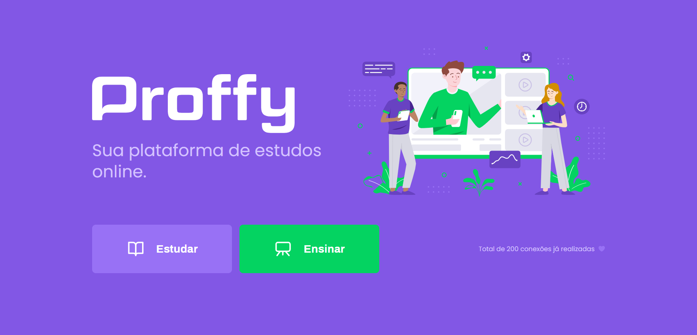

<h1 align="center">
    
</h1>

<h4 align="center">
  Next Level Week #2
</h4>

<p align="center">
  <a href="#rocket-tecnologias"> :rocket: Tecnologias</a>&nbsp;&nbsp;&nbsp;|&nbsp;&nbsp;&nbsp;
  <a href="#-projeto">💻 Projeto</a>&nbsp;&nbsp;&nbsp;|&nbsp;&nbsp;&nbsp;
  <a href="#-como-executar">🔖 Como Executar</a>&nbsp;&nbsp;&nbsp;
</p>

<br>

## :rocket: Tecnologias

Este projeto contém as seguintes tecnologias:

- [React](https://reactjs.org)
- [TypeScript](https://www.typescriptlang.org/)
- [Expo](https://expo.io/)

## 💻 Projeto

O Proffy é uma proposta de projeto que busca aproximar e facilitar a vida de professores e alunos no aprendizado do dia-a-dia. É possível que o aluno visualize professores disponíveis para lecionar uma matéria de seu interesse, e entrar em contato com eles através do contato pelo WhatsApp. Já para um professor, através do WebSite, o mesmo pode se registar e oferecer seus serviços e materiais para novos alunos.

## 🔖 Como Executar

#### Clonando o projeto
```sh

git https://github.com/LeonardoGarbelotti/Next-Level-Week2.git

```
#### Instalação
No seu terminal, siga as instruções abaixo para instalar a dependência no projeto.
```sh

cd web
yarn add @types/react-router-dom -D

```
É nescessário passar @types pois no projeto é utilizado linguagem tipada (TypeScript).

#### Iniciando a aplicação
```sh

cd web
yarn start

```
